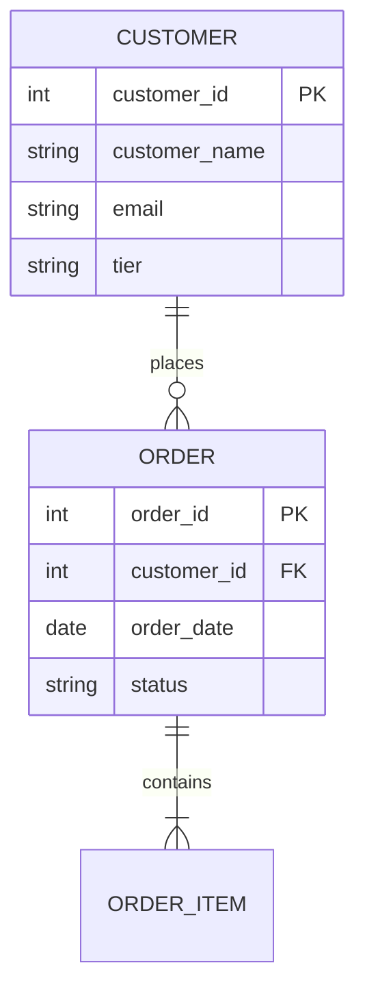

# MDDE - Metadata-Driven Data Engineering

A framework for modeling data platforms using YAML-based metadata that generates DDL, documentation, and lineage across multiple target platforms.

## What is MDDE?

MDDE (Metadata-Driven Data Engineering) is an approach where you define your data models once in YAML and generate:

- **DDL scripts** for Snowflake, Databricks, BigQuery, SQL Server, etc.
- **dbt models** with proper materializations and tests
- **Documentation** with ERD diagrams and data dictionaries
- **Lineage** at entity and column level
- **Data Vault / Dimensional** patterns with stereotype-driven generation

## Quick Start

```bash
# Clone this demo repository
git clone https://github.com/jacovanderlaan/mdde-demo.git
cd mdde-demo

# Explore the sample models
ls models/
```

## Repository Structure

```
mdde-demo/
├── models/                    # Sample YAML models
│   ├── ecommerce/            # E-commerce example (customers, orders, products)
│   ├── data-vault/           # Data Vault pattern example
│   └── dimensional/          # Dimensional model example
├── schemas/                   # JSON schemas for YAML validation
├── generated/                 # Example generated outputs
│   ├── ddl/                  # DDL scripts per dialect
│   ├── dbt/                  # dbt model examples
│   └── docs/                 # Generated documentation
├── tools/                    # Standalone utilities
│   └── cte-regression/       # SQL regression analysis tool
└── articles/                 # Links to Medium articles
```

## Sample Model

Here's what an MDDE entity looks like:

```yaml
# models/ecommerce/entities/customer/entity.logical.yaml
entity_id: customer
name: Customer
description: Customer master data
stereotype: dim_scd2
layer: business

attributes:
  - attribute_id: customer_id
    name: Customer ID
    data_type: integer
    is_primary_key: true

  - attribute_id: customer_name
    name: Customer Name
    data_type: varchar(100)
    is_nullable: false

  - attribute_id: email
    name: Email Address
    data_type: varchar(255)
    pii_classification: email

  - attribute_id: tier
    name: Customer Tier
    data_type: varchar(20)
    domain: customer_tier  # References domain for valid values

relationships:
  - relationship_id: customer_orders
    target_entity: order
    cardinality: one_to_many
    foreign_key: customer_id
```

## Supported Stereotypes

MDDE supports various architectural patterns through stereotypes:

| Pattern | Stereotypes |
|---------|-------------|
| **Data Vault** | `dv_hub`, `dv_link`, `dv_satellite`, `dv_pit`, `dv_bridge` |
| **Dimensional** | `dim_fact`, `dim_dimension`, `dim_scd1`, `dim_scd2`, `dim_reference` |
| **Staging** | `stg_raw`, `stg_cleaned`, `stg_persistent` |
| **Delivery** | `del_api`, `del_report`, `del_view` |

## Three-Layer Architecture

MDDE uses a three-layer modeling approach:

1. **Conceptual** - Business entities and relationships (no technical details)
2. **Logical** - Attributes, data types, keys, domains
3. **Technical** - Platform-specific settings (partitioning, clustering, etc.)

## Generated Outputs

From a single YAML model, MDDE can generate:

### DDL (Multiple Dialects)
```sql
-- Snowflake
CREATE TABLE business.dim_customer (
    customer_sk NUMBER AUTOINCREMENT,
    customer_id NUMBER NOT NULL,
    customer_name VARCHAR(100) NOT NULL,
    email VARCHAR(255),
    tier VARCHAR(20),
    valid_from TIMESTAMP_NTZ NOT NULL,
    valid_to TIMESTAMP_NTZ,
    is_current BOOLEAN DEFAULT TRUE,
    PRIMARY KEY (customer_sk)
);

-- Databricks
CREATE TABLE business.dim_customer (
    customer_sk BIGINT GENERATED ALWAYS AS IDENTITY,
    ...
) USING DELTA
TBLPROPERTIES ('delta.autoOptimize.optimizeWrite' = 'true');
```

### dbt Models
```sql
-- models/business/dim_customer.sql
{{ config(
    materialized='incremental',
    unique_key='customer_sk',
    incremental_strategy='merge'
) }}

SELECT
    {{ dbt_utils.generate_surrogate_key(['customer_id']) }} as customer_sk,
    customer_id,
    customer_name,
    email,
    tier,
    ...
```

### ERD Diagrams


## Standalone Tools

This repository includes standalone tools that work independently:

### CTE Regression Analysis

Compare SQL queries to detect regressions when refactoring:

```python
from cte_regression import quick_compare

results = quick_compare(
    QUERY_LEGACY,
    QUERY_NEW,
    key_columns={"final": ["customer_id"]}
)
```

See [tools/cte-regression/](tools/cte-regression/) for details.

## Articles

Learn more about MDDE through these Medium articles:

1. [Introduction to Metadata-Driven Data Engineering](https://medium.com/@jaco.vanderlaan)
2. [Modeling Data Vault with MDDE](https://medium.com/@jaco.vanderlaan)
3. [Generating Multi-Dialect DDL](https://medium.com/@jaco.vanderlaan)
4. [Column-Level Lineage](https://medium.com/@jaco.vanderlaan)

## Want the Full Framework?

This demo repository shows the concepts and sample outputs. The full MDDE framework includes:

- Complete Python engine for parsing and generation
- VS Code extension with IntelliSense and visualization
- CLI tools for batch generation
- GenAI-powered modeling assistance
- Advanced features (FCO-IM, migrations, regulatory compliance)

**For access to the full framework:**
- Workshops and training sessions
- Consulting engagements
- Enterprise licensing

Contact: [Your contact info]

## License

This demo repository is provided for educational purposes. See [LICENSE](LICENSE) for details.
