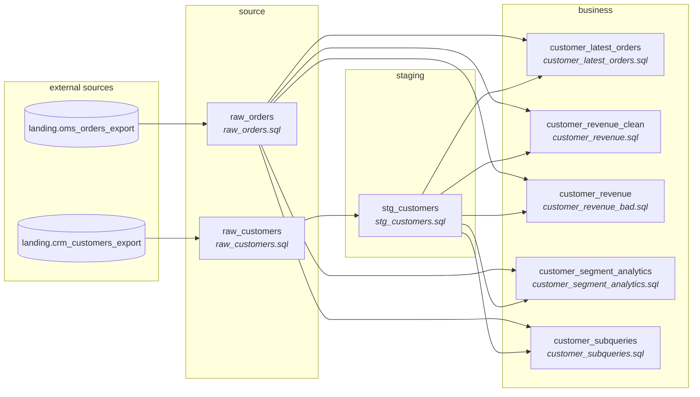

# sql_process — run report

Files processed: **8**

## Files

| File | Entity | Layer | Qualified | CTEs | Sources | Output cols | Quality issues |
|---|---|---|---|---|---|---|---|
| `customer_latest_orders.sql` | customer_latest_orders | business | yes | 2 | 2 | 6 | 5 |
| `customer_revenue.sql` | customer_revenue_clean | business | yes | 2 | 2 | 7 | 5 |
| `customer_revenue_bad.sql` | customer_revenue | business | yes | 2 | 2 | 10 | 11 |
| `customer_segment_analytics.sql` | customer_segment_analytics | business | yes | 3 | 2 | 10 | 9 |
| `customer_subqueries.sql` | customer_subqueries | business | yes | 0 | 2 | 7 | 12 |
| `raw_customers.sql` | raw_customers | source | yes | 0 | 1 | 7 | 4 |
| `raw_orders.sql` | raw_orders | source | yes | 0 | 1 | 7 | 3 |
| `stg_customers.sql` | stg_customers | staging | yes | 0 | 1 | 7 | 4 |

## Quality findings

**Total:** 53 (error=3, warning=10, info=40)  
**Auto-fixed:** 1

| File | Location | Rule | Severity | Auto-fixed | Message |
|---|---|---|---|---|---|
| `customer_latest_orders.sql` | <file> | MISSING_ALIAS | info | no | Table 'customer_latest_orders' has no alias in multi-table query |
| `customer_latest_orders.sql` | <file> | MISSING_ALIAS | info | no | Table 'raw_orders' has no alias in multi-table query |
| `customer_latest_orders.sql` | <file> | MISSING_ALIAS | info | no | Table 'ordered_orders' has no alias in multi-table query |
| `customer_latest_orders.sql` | <file> | WINDOW_NON_UNIQUE_ORDER | warning | no | ROW_NUMBER() ORDER BY (order_date, order_id) may not be unique within partition |
| `customer_latest_orders.sql` | <file> | VOLATILE_FUNCTION | info | no | CURRENT_DATE() returns current time - varies between runs |
| `customer_revenue.sql` | <file> | SELECT_STAR | warning | no | SELECT * detected - explicit column list recommended |
| `customer_revenue.sql` | <file> | MISSING_ALIAS | info | no | Table 'customer_revenue_clean' has no alias in multi-table query |
| `customer_revenue.sql` | <file> | MISSING_ALIAS | info | no | Table 'raw_orders' has no alias in multi-table query |
| `customer_revenue.sql` | <file> | MISSING_ALIAS | info | no | Table 'shipped_orders' has no alias in multi-table query |
| `customer_revenue.sql` | <file> | PK_DEDUP_CHECK_MISSING | info | no | @pk annotations present but no ROW_NUMBER PARTITION BY <pk> for dedup verific... |
| `customer_revenue_bad.sql` | <file> | SELECT_STAR | warning | no | SELECT * detected - explicit column list recommended |
| `customer_revenue_bad.sql` | <file> | SELECT_STAR | warning | no | SELECT * detected - explicit column list recommended |
| `customer_revenue_bad.sql` | <file> | MISSING_ALIAS | info | no | Table 'customer_revenue' has no alias in multi-table query |
| `customer_revenue_bad.sql` | <file> | MISSING_ALIAS | info | no | Table 'joined' has no alias in multi-table query |
| `customer_revenue_bad.sql` | <file> | MISSING_ALIAS | info | no | Table 'raw_orders' has no alias in multi-table query |
| `customer_revenue_bad.sql` | <file> | ORDER_BY_NUMBER | warning | no | ORDER BY uses column number (1) instead of name |
| `customer_revenue_bad.sql` | <file> | WHERE_1_EQUALS_1 | info | yes | WHERE 1=1 pattern detected |
| `customer_revenue_bad.sql` | <file> | CARTESIAN_JOIN | warning | no | JOIN to 'stg_customers' without ON clause - potential cartesian product |
| `customer_revenue_bad.sql` | <file> | HARDCODED_DATE | info | no | Hardcoded date literal: '2026-01-01' |
| `customer_revenue_bad.sql` | <file> | PK_DEDUP_CHECK_MISSING | info | no | @pk annotations present but no ROW_NUMBER PARTITION BY <pk> for dedup verific... |
| `customer_revenue_bad.sql` | <file> | WINDOW_NO_ORDER | error | no | ROW_NUMBER() without ORDER BY - results are non-deterministic |
| `customer_segment_analytics.sql` | <file> | SELECT_STAR | warning | no | SELECT * detected - explicit column list recommended |
| `customer_segment_analytics.sql` | <file> | MISSING_ALIAS | info | no | Table 'customer_segment_analytics' has no alias in multi-table query |
| `customer_segment_analytics.sql` | <file> | MISSING_ALIAS | info | no | Table 'raw_orders' has no alias in multi-table query |
| `customer_segment_analytics.sql` | <file> | MISSING_ALIAS | info | no | Table 'shipped_orders' has no alias in multi-table query |
| `customer_segment_analytics.sql` | <file> | MISSING_ALIAS | info | no | Table 'customer_totals' has no alias in multi-table query |
| `customer_segment_analytics.sql` | <file> | MISSING_ALIAS | info | no | Table 'customer_totals' has no alias in multi-table query |
| `customer_segment_analytics.sql` | <file> | MISSING_GROUP_BY | error | no | Aggregate function mixed with non-aggregated columns without GROUP BY |
| `customer_segment_analytics.sql` | <file> | PK_DEDUP_CHECK_MISSING | info | no | @pk annotations present but no ROW_NUMBER PARTITION BY <pk> for dedup verific... |
| `customer_segment_analytics.sql` | <file> | WINDOW_NON_UNIQUE_ORDER | warning | no | ROW_NUMBER() ORDER BY (total_revenue) may not be unique within partition |
| `customer_subqueries.sql` | <file> | SELECT_STAR | warning | no | SELECT * detected - explicit column list recommended |
| `customer_subqueries.sql` | <file> | SELECT_STAR | warning | no | SELECT * detected - explicit column list recommended |
| `customer_subqueries.sql` | <file> | MISSING_ALIAS | info | no | Table 'customer_subqueries' has no alias in multi-table query |
| `customer_subqueries.sql` | <file> | MISSING_ALIAS | info | no | Table 'raw_orders' has no alias in multi-table query |
| `customer_subqueries.sql` | <file> | MISSING_ALIAS | info | no | Table 'raw_orders' has no alias in multi-table query |
| `customer_subqueries.sql` | <file> | MISSING_ALIAS | info | no | Table 'raw_orders' has no alias in multi-table query |
| `customer_subqueries.sql` | <file> | MISSING_ALIAS | info | no | Table 'raw_orders' has no alias in multi-table query |
| `customer_subqueries.sql` | <file> | MISSING_GROUP_BY | error | no | Aggregate function mixed with non-aggregated columns without GROUP BY |
| `customer_subqueries.sql` | <file> | COMBINED_SOURCE_FILTERS | info | no | WHERE clause references columns from 2 sources (c, o) |
| `customer_subqueries.sql` | <file> | PK_DEDUP_CHECK_MISSING | info | no | @pk annotations present but no ROW_NUMBER PARTITION BY <pk> for dedup verific... |
| `customer_subqueries.sql` | <predicate> | SUBQUERY_NOT_LIFTED | info | no | Subquery inside In left inline — lifting an IN/EXISTS/comparison subquery wou... |
| `customer_subqueries.sql` | <correlated> | SUBQUERY_NOT_LIFTED | info | no | Correlated subquery left inline — references an outer scope that a CTE cannot... |
| `raw_customers.sql` | <file> | MISSING_ALIAS | info | no | Table 'raw_customers' has no alias in multi-table query |
| `raw_customers.sql` | <file> | MISSING_ALIAS | info | no | Table 'crm_customers_export' has no alias in multi-table query |
| `raw_customers.sql` | <file> | DERIVATION_IN_WHERE | info | no | IS [NOT] NULL on raw column '_ingested_at' inside WHERE |
| `raw_customers.sql` | <file> | PK_DEDUP_CHECK_MISSING | info | no | @pk annotations present but no ROW_NUMBER PARTITION BY <pk> for dedup verific... |
| `raw_orders.sql` | <file> | MISSING_ALIAS | info | no | Table 'raw_orders' has no alias in multi-table query |
| `raw_orders.sql` | <file> | MISSING_ALIAS | info | no | Table 'oms_orders_export' has no alias in multi-table query |
| `raw_orders.sql` | <file> | PK_DEDUP_CHECK_MISSING | info | no | @pk annotations present but no ROW_NUMBER PARTITION BY <pk> for dedup verific... |
| `stg_customers.sql` | <file> | MISSING_ALIAS | info | no | Table 'stg_customers' has no alias in multi-table query |
| `stg_customers.sql` | <file> | MISSING_ALIAS | info | no | Table 'raw_customers' has no alias in multi-table query |
| `stg_customers.sql` | <file> | DERIVATION_IN_WHERE | info | no | IS [NOT] NULL on raw column 'customer_id' inside WHERE |
| `stg_customers.sql` | <file> | PK_DEDUP_CHECK_MISSING | info | no | @pk annotations present but no ROW_NUMBER PARTITION BY <pk> for dedup verific... |

## Mapping coverage

**61/61** output columns have a resolved source attribute (100%)

## Cross-file lineage

**11** producer-consumer edge(s) stitched across the file set.

| Producer | Consumer | Via table |
|---|---|---|
| `raw_customers.sql` | `stg_customers.sql` | `raw_customers` |
| `raw_orders.sql` | `customer_latest_orders.sql` | `raw_orders` |
| `raw_orders.sql` | `customer_revenue.sql` | `raw_orders` |
| `raw_orders.sql` | `customer_revenue_bad.sql` | `raw_orders` |
| `raw_orders.sql` | `customer_segment_analytics.sql` | `raw_orders` |
| `raw_orders.sql` | `customer_subqueries.sql` | `raw_orders` |
| `stg_customers.sql` | `customer_latest_orders.sql` | `stg_customers` |
| `stg_customers.sql` | `customer_revenue.sql` | `stg_customers` |
| `stg_customers.sql` | `customer_revenue_bad.sql` | `stg_customers` |
| `stg_customers.sql` | `customer_segment_analytics.sql` | `stg_customers` |
| `stg_customers.sql` | `customer_subqueries.sql` | `stg_customers` |

## SQL-First annotations

| File | Entity | Annotated columns | Tags found |
|---|---|---|---|
| `customer_latest_orders.sql` | customer_latest_orders | 3 | derived, fk, pk |
| `customer_revenue.sql` | customer_revenue_clean | 1 | pk |
| `customer_revenue_bad.sql` | customer_revenue | 1 | pk |
| `customer_segment_analytics.sql` | customer_segment_analytics | 1 | derived |
| `customer_subqueries.sql` | customer_subqueries | 0 | — |
| `raw_customers.sql` | raw_customers | 5 | business_key, nullable, pii, pk |
| `raw_orders.sql` | raw_orders | 2 | business_key, fk, pk |
| `stg_customers.sql` | stg_customers | 3 | business_key, pii, pk |
