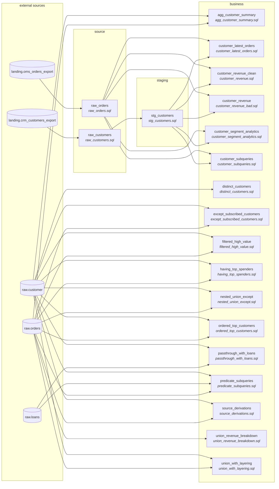

# sql_process — run report

Files processed: **20**

## Files

| File | Entity | Layer | Qualified | CTEs | Sources | Output cols | Quality issues |
|---|---|---|---|---|---|---|---|
| `agg_customer_summary.sql` | agg_customer_summary | business | yes | 0 | 2 | 8 | 2 |
| `customer_latest_orders.sql` | customer_latest_orders | business | yes | 2 | 2 | 6 | 6 |
| `customer_revenue.sql` | customer_revenue_clean | business | yes | 2 | 2 | 7 | 6 |
| `customer_revenue_bad.sql` | customer_revenue | business | yes | 2 | 2 | 10 | 12 |
| `customer_segment_analytics.sql` | customer_segment_analytics | business | yes | 3 | 2 | 10 | 10 |
| `customer_subqueries.sql` | customer_subqueries | business | yes | 0 | 2 | 7 | 12 |
| `distinct_customers.sql` | distinct_customers | business | yes | 0 | 1 | 3 | 3 |
| `except_subscribed_customers.sql` | except_subscribed_customers | business | yes | 0 | 2 | 2 | 2 |
| `filtered_high_value.sql` | filtered_high_value | business | yes | 0 | 2 | 4 | 2 |
| `having_top_spenders.sql` | having_top_spenders | business | yes | 0 | 2 | 4 | 3 |
| `nested_union_except.sql` | nested_union_except | business | yes | 0 | 2 | 2 | 9 |
| `ordered_top_customers.sql` | ordered_top_customers | business | yes | 0 | 2 | 4 | 1 |
| `passthrough_with_loans.sql` | passthrough_with_loans | business | yes | 2 | 2 | 6 | 6 |
| `predicate_subqueries.sql` | predicate_subqueries | business | yes | 0 | 3 | 3 | 3 |
| `raw_customers.sql` | raw_customers | source | yes | 0 | 1 | 7 | 5 |
| `raw_orders.sql` | raw_orders | source | yes | 0 | 1 | 7 | 4 |
| `source_derivations.sql` | source_derivations | business | yes | 0 | 2 | 13 | 1 |
| `stg_customers.sql` | stg_customers | staging | yes | 0 | 1 | 7 | 5 |
| `union_revenue_breakdown.sql` | union_revenue_breakdown | business | yes | 0 | 1 | 4 | 3 |
| `union_with_layering.sql` | union_with_layering | business | yes | 0 | 2 | 4 | 9 |

## Quality findings

**Total:** 104 (error=3, warning=26, info=75)  
**Auto-fixed:** 1

| File | Location | Rule | Severity | Auto-fixed | Message |
|---|---|---|---|---|---|
| `agg_customer_summary.sql` | <file> | SELECT_STAR | warning | no | SELECT * detected - explicit column list recommended |
| `agg_customer_summary.sql` | <file> | MISSING_SOURCE_VERSION | info | no | Filename 'agg_customer_summary.sql' has fewer than 3 hyphen-separated parts; ... |
| `customer_latest_orders.sql` | <file> | MISSING_ALIAS | info | no | Table 'customer_latest_orders' has no alias in multi-table query |
| `customer_latest_orders.sql` | <file> | MISSING_ALIAS | info | no | Table 'raw_orders' has no alias in multi-table query |
| `customer_latest_orders.sql` | <file> | MISSING_ALIAS | info | no | Table 'ordered_orders' has no alias in multi-table query |
| `customer_latest_orders.sql` | <file> | WINDOW_NON_UNIQUE_ORDER | warning | no | ROW_NUMBER() ORDER BY (order_date, order_id) may not be unique within partition |
| `customer_latest_orders.sql` | <file> | VOLATILE_FUNCTION | info | no | CURRENT_DATE() returns current time - varies between runs |
| `customer_latest_orders.sql` | <file> | MISSING_SOURCE_VERSION | info | no | Filename 'customer_latest_orders.sql' has fewer than 3 hyphen-separated parts... |
| `customer_revenue.sql` | <file> | SELECT_STAR | warning | no | SELECT * detected - explicit column list recommended |
| `customer_revenue.sql` | <file> | MISSING_ALIAS | info | no | Table 'customer_revenue_clean' has no alias in multi-table query |
| `customer_revenue.sql` | <file> | MISSING_ALIAS | info | no | Table 'raw_orders' has no alias in multi-table query |
| `customer_revenue.sql` | <file> | MISSING_ALIAS | info | no | Table 'shipped_orders' has no alias in multi-table query |
| `customer_revenue.sql` | <file> | PK_DEDUP_CHECK_MISSING | info | no | @pk annotations present but no ROW_NUMBER PARTITION BY <pk> for dedup verific... |
| `customer_revenue.sql` | <file> | MISSING_SOURCE_VERSION | info | no | Filename 'customer_revenue.sql' has fewer than 3 hyphen-separated parts; move... |
| `customer_revenue_bad.sql` | <file> | SELECT_STAR | warning | no | SELECT * detected - explicit column list recommended |
| `customer_revenue_bad.sql` | <file> | SELECT_STAR | warning | no | SELECT * detected - explicit column list recommended |
| `customer_revenue_bad.sql` | <file> | MISSING_ALIAS | info | no | Table 'customer_revenue' has no alias in multi-table query |
| `customer_revenue_bad.sql` | <file> | MISSING_ALIAS | info | no | Table 'joined' has no alias in multi-table query |
| `customer_revenue_bad.sql` | <file> | MISSING_ALIAS | info | no | Table 'raw_orders' has no alias in multi-table query |
| `customer_revenue_bad.sql` | <file> | ORDER_BY_NUMBER | warning | no | ORDER BY uses column number (1) instead of name |
| `customer_revenue_bad.sql` | <file> | WHERE_1_EQUALS_1 | info | yes | WHERE 1=1 pattern detected |
| `customer_revenue_bad.sql` | <file> | CARTESIAN_JOIN | warning | no | JOIN to 'stg_customers' without ON clause - potential cartesian product |
| `customer_revenue_bad.sql` | <file> | HARDCODED_DATE | info | no | Hardcoded date literal: '2026-01-01' |
| `customer_revenue_bad.sql` | <file> | PK_DEDUP_CHECK_MISSING | info | no | @pk annotations present but no ROW_NUMBER PARTITION BY <pk> for dedup verific... |
| `customer_revenue_bad.sql` | <file> | WINDOW_NO_ORDER | error | no | ROW_NUMBER() without ORDER BY - results are non-deterministic |
| `customer_revenue_bad.sql` | <file> | MISSING_SOURCE_VERSION | info | no | Filename 'customer_revenue_bad.sql' has fewer than 3 hyphen-separated parts; ... |
| `customer_segment_analytics.sql` | <file> | SELECT_STAR | warning | no | SELECT * detected - explicit column list recommended |
| `customer_segment_analytics.sql` | <file> | MISSING_ALIAS | info | no | Table 'customer_segment_analytics' has no alias in multi-table query |
| `customer_segment_analytics.sql` | <file> | MISSING_ALIAS | info | no | Table 'raw_orders' has no alias in multi-table query |
| `customer_segment_analytics.sql` | <file> | MISSING_ALIAS | info | no | Table 'shipped_orders' has no alias in multi-table query |
| `customer_segment_analytics.sql` | <file> | MISSING_ALIAS | info | no | Table 'customer_totals' has no alias in multi-table query |
| `customer_segment_analytics.sql` | <file> | MISSING_ALIAS | info | no | Table 'customer_totals' has no alias in multi-table query |
| `customer_segment_analytics.sql` | <file> | MISSING_GROUP_BY | error | no | Aggregate function mixed with non-aggregated columns without GROUP BY |
| `customer_segment_analytics.sql` | <file> | PK_DEDUP_CHECK_MISSING | info | no | @pk annotations present but no ROW_NUMBER PARTITION BY <pk> for dedup verific... |
| `customer_segment_analytics.sql` | <file> | WINDOW_NON_UNIQUE_ORDER | warning | no | ROW_NUMBER() ORDER BY (total_revenue) may not be unique within partition |
| `customer_segment_analytics.sql` | <file> | MISSING_SOURCE_VERSION | info | no | Filename 'customer_segment_analytics.sql' has fewer than 3 hyphen-separated p... |
| `customer_subqueries.sql` | <file> | SELECT_STAR | warning | no | SELECT * detected - explicit column list recommended |
| `customer_subqueries.sql` | <file> | SELECT_STAR | warning | no | SELECT * detected - explicit column list recommended |
| `customer_subqueries.sql` | <file> | MISSING_ALIAS | info | no | Table 'customer_subqueries' has no alias in multi-table query |
| `customer_subqueries.sql` | <file> | MISSING_ALIAS | info | no | Table 'raw_orders' has no alias in multi-table query |
| `customer_subqueries.sql` | <file> | MISSING_ALIAS | info | no | Table 'raw_orders' has no alias in multi-table query |
| `customer_subqueries.sql` | <file> | MISSING_ALIAS | info | no | Table 'raw_orders' has no alias in multi-table query |
| `customer_subqueries.sql` | <file> | MISSING_ALIAS | info | no | Table 'raw_orders' has no alias in multi-table query |
| `customer_subqueries.sql` | <file> | MISSING_GROUP_BY | error | no | Aggregate function mixed with non-aggregated columns without GROUP BY |
| `customer_subqueries.sql` | <file> | COMBINED_SOURCE_FILTERS | info | no | WHERE clause references columns from 2 sources (c, o) |
| `customer_subqueries.sql` | <file> | PK_DEDUP_CHECK_MISSING | info | no | @pk annotations present but no ROW_NUMBER PARTITION BY <pk> for dedup verific... |
| `customer_subqueries.sql` | <file> | MISSING_SOURCE_VERSION | info | no | Filename 'customer_subqueries.sql' has fewer than 3 hyphen-separated parts; m... |
| `customer_subqueries.sql` | <correlated> | SUBQUERY_NOT_LIFTED | info | no | Correlated subquery in FROM/SELECT position left inline — lifting would orpha... |
| `distinct_customers.sql` | <file> | DERIVATION_IN_WHERE | info | no | IS [NOT] NULL on raw column 'email' inside WHERE |
| `distinct_customers.sql` | <file> | DISTINCT_WITHOUT_JUSTIFICATION | info | no | DISTINCT used without a justifying comment |
| `distinct_customers.sql` | <file> | MISSING_SOURCE_VERSION | info | no | Filename 'distinct_customers.sql' has fewer than 3 hyphen-separated parts; mo... |
| `except_subscribed_customers.sql` | <file> | DERIVATION_IN_WHERE | info | no | IS [NOT] NULL on raw column 'email' inside WHERE |
| `except_subscribed_customers.sql` | <file> | MISSING_SOURCE_VERSION | info | no | Filename 'except_subscribed_customers.sql' has fewer than 3 hyphen-separated ... |
| `filtered_high_value.sql` | <file> | COMBINED_SOURCE_FILTERS | info | no | WHERE clause references columns from 2 sources (c, o) |
| `filtered_high_value.sql` | <file> | MISSING_SOURCE_VERSION | info | no | Filename 'filtered_high_value.sql' has fewer than 3 hyphen-separated parts; m... |
| `having_top_spenders.sql` | <file> | SELECT_STAR | warning | no | SELECT * detected - explicit column list recommended |
| `having_top_spenders.sql` | <file> | SELECT_STAR | warning | no | SELECT * detected - explicit column list recommended |
| `having_top_spenders.sql` | <file> | MISSING_SOURCE_VERSION | info | no | Filename 'having_top_spenders.sql' has fewer than 3 hyphen-separated parts; m... |
| `nested_union_except.sql` | <file> | MISSING_ALIAS | info | no | Table 'orders' has no alias in multi-table query |
| `nested_union_except.sql` | <file> | MISSING_ALIAS | info | no | Table 'customer' has no alias in multi-table query |
| `nested_union_except.sql` | <file> | MISSING_ALIAS | info | no | Table 'orders' has no alias in multi-table query |
| `nested_union_except.sql` | <file> | MISSING_ALIAS | info | no | Table 'orders' has no alias in multi-table query |
| `nested_union_except.sql` | <file> | HARDCODED_DATE | info | no | Hardcoded date literal: '2024-01-01' |
| `nested_union_except.sql` | <file> | INLINE_UNION_TRANSFORM | warning | no | WHERE clause inside UNION ALL branch |
| `nested_union_except.sql` | <file> | INLINE_UNION_TRANSFORM | warning | no | WHERE clause inside UNION ALL branch |
| `nested_union_except.sql` | <file> | INLINE_UNION_TRANSFORM | warning | no | WHERE clause inside UNION ALL branch |
| `nested_union_except.sql` | <file> | MISSING_SOURCE_VERSION | info | no | Filename 'nested_union_except.sql' has fewer than 3 hyphen-separated parts; m... |
| `ordered_top_customers.sql` | <file> | MISSING_SOURCE_VERSION | info | no | Filename 'ordered_top_customers.sql' has fewer than 3 hyphen-separated parts;... |
| `passthrough_with_loans.sql` | <file> | SELECT_STAR | warning | no | SELECT * detected - explicit column list recommended |
| `passthrough_with_loans.sql` | <file> | SELECT_STAR | warning | no | SELECT * detected - explicit column list recommended |
| `passthrough_with_loans.sql` | <file> | MISSING_ALIAS | info | no | Table 'customer' has no alias in multi-table query |
| `passthrough_with_loans.sql` | <file> | MISSING_ALIAS | info | no | Table 'loans' has no alias in multi-table query |
| `passthrough_with_loans.sql` | <file> | DERIVATION_IN_WHERE | info | no | IS [NOT] NULL on raw column 'email' inside WHERE |
| `passthrough_with_loans.sql` | <file> | MISSING_SOURCE_VERSION | info | no | Filename 'passthrough_with_loans.sql' has fewer than 3 hyphen-separated parts... |
| `predicate_subqueries.sql` | <file> | COMBINED_SOURCE_FILTERS | info | no | WHERE clause references columns from 3 sources (c, l, o) |
| `predicate_subqueries.sql` | <file> | COMBINED_SOURCE_FILTERS | info | no | WHERE clause references columns from 2 sources (c, l) |
| `predicate_subqueries.sql` | <file> | MISSING_SOURCE_VERSION | info | no | Filename 'predicate_subqueries.sql' has fewer than 3 hyphen-separated parts; ... |
| `raw_customers.sql` | <file> | MISSING_ALIAS | info | no | Table 'raw_customers' has no alias in multi-table query |
| `raw_customers.sql` | <file> | MISSING_ALIAS | info | no | Table 'crm_customers_export' has no alias in multi-table query |
| `raw_customers.sql` | <file> | DERIVATION_IN_WHERE | info | no | IS [NOT] NULL on raw column '_ingested_at' inside WHERE |
| `raw_customers.sql` | <file> | PK_DEDUP_CHECK_MISSING | info | no | @pk annotations present but no ROW_NUMBER PARTITION BY <pk> for dedup verific... |
| `raw_customers.sql` | <file> | MISSING_SOURCE_VERSION | info | no | Filename 'raw_customers.sql' has fewer than 3 hyphen-separated parts; movemen... |
| `raw_orders.sql` | <file> | MISSING_ALIAS | info | no | Table 'raw_orders' has no alias in multi-table query |
| `raw_orders.sql` | <file> | MISSING_ALIAS | info | no | Table 'oms_orders_export' has no alias in multi-table query |
| `raw_orders.sql` | <file> | PK_DEDUP_CHECK_MISSING | info | no | @pk annotations present but no ROW_NUMBER PARTITION BY <pk> for dedup verific... |
| `raw_orders.sql` | <file> | MISSING_SOURCE_VERSION | info | no | Filename 'raw_orders.sql' has fewer than 3 hyphen-separated parts; movement.c... |
| `source_derivations.sql` | <file> | MISSING_SOURCE_VERSION | info | no | Filename 'source_derivations.sql' has fewer than 3 hyphen-separated parts; mo... |
| `stg_customers.sql` | <file> | MISSING_ALIAS | info | no | Table 'stg_customers' has no alias in multi-table query |
| `stg_customers.sql` | <file> | MISSING_ALIAS | info | no | Table 'raw_customers' has no alias in multi-table query |
| `stg_customers.sql` | <file> | DERIVATION_IN_WHERE | info | no | IS [NOT] NULL on raw column 'customer_id' inside WHERE |
| `stg_customers.sql` | <file> | PK_DEDUP_CHECK_MISSING | info | no | @pk annotations present but no ROW_NUMBER PARTITION BY <pk> for dedup verific... |
| `stg_customers.sql` | <file> | MISSING_SOURCE_VERSION | info | no | Filename 'stg_customers.sql' has fewer than 3 hyphen-separated parts; movemen... |
| `union_revenue_breakdown.sql` | <file> | INLINE_UNION_TRANSFORM | warning | no | WHERE clause inside UNION ALL branch |
| `union_revenue_breakdown.sql` | <file> | INLINE_UNION_TRANSFORM | warning | no | WHERE clause inside UNION ALL branch |
| `union_revenue_breakdown.sql` | <file> | MISSING_SOURCE_VERSION | info | no | Filename 'union_revenue_breakdown.sql' has fewer than 3 hyphen-separated part... |
| `union_with_layering.sql` | <file> | SELECT_STAR | warning | no | SELECT * detected - explicit column list recommended |
| `union_with_layering.sql` | <file> | SELECT_STAR | warning | no | SELECT * detected - explicit column list recommended |
| `union_with_layering.sql` | <file> | INLINE_UNION_TRANSFORM | warning | no | Transformation inside UNION ALL branch: CAST(SUM(o.amount) AS DECIMAL(18, 2))... |
| `union_with_layering.sql` | <file> | INLINE_UNION_TRANSFORM | warning | no | WHERE clause inside UNION ALL branch |
| `union_with_layering.sql` | <file> | INLINE_UNION_TRANSFORM | warning | no | Transformation inside UNION ALL branch: CAST(SUM(o.amount) AS DECIMAL(18, 2))... |
| `union_with_layering.sql` | <file> | INLINE_UNION_TRANSFORM | warning | no | WHERE clause inside UNION ALL branch |
| `union_with_layering.sql` | <file> | GROUPBY_NOT_ISOLATED | info | no | GROUP BY combined with WHERE and JOINs in a single SELECT |
| `union_with_layering.sql` | <file> | GROUPBY_NOT_ISOLATED | info | no | GROUP BY combined with WHERE and JOINs in a single SELECT |
| `union_with_layering.sql` | <file> | MISSING_SOURCE_VERSION | info | no | Filename 'union_with_layering.sql' has fewer than 3 hyphen-separated parts; m... |

## Mapping coverage

**110/118** output columns have a resolved source attribute (93%)

## Cross-file lineage

**11** producer-consumer edge(s) stitched across the file set.

| Producer | Consumer | Via table |
|---|---|---|
| `raw_customers.sql` | `stg_customers.sql` | `raw_customers` |
| `raw_orders.sql` | `customer_latest_orders.sql` | `raw_orders` |
| `raw_orders.sql` | `customer_revenue.sql` | `raw_orders` |
| `raw_orders.sql` | `customer_revenue_bad.sql` | `raw_orders` |
| `raw_orders.sql` | `customer_segment_analytics.sql` | `raw_orders` |
| `raw_orders.sql` | `customer_subqueries.sql` | `raw_orders` |
| `stg_customers.sql` | `customer_latest_orders.sql` | `stg_customers` |
| `stg_customers.sql` | `customer_revenue.sql` | `stg_customers` |
| `stg_customers.sql` | `customer_revenue_bad.sql` | `stg_customers` |
| `stg_customers.sql` | `customer_segment_analytics.sql` | `stg_customers` |
| `stg_customers.sql` | `customer_subqueries.sql` | `stg_customers` |

## SQL-First annotations

| File | Entity | Annotated columns | Tags found |
|---|---|---|---|
| `agg_customer_summary.sql` | agg_customer_summary | 0 | — |
| `customer_latest_orders.sql` | customer_latest_orders | 3 | derived, fk, pk |
| `customer_revenue.sql` | customer_revenue_clean | 1 | pk |
| `customer_revenue_bad.sql` | customer_revenue | 1 | pk |
| `customer_segment_analytics.sql` | customer_segment_analytics | 1 | derived |
| `customer_subqueries.sql` | customer_subqueries | 0 | — |
| `distinct_customers.sql` | distinct_customers | 0 | — |
| `except_subscribed_customers.sql` | except_subscribed_customers | 0 | — |
| `filtered_high_value.sql` | filtered_high_value | 0 | — |
| `having_top_spenders.sql` | having_top_spenders | 0 | — |
| `nested_union_except.sql` | nested_union_except | 0 | — |
| `ordered_top_customers.sql` | ordered_top_customers | 0 | — |
| `passthrough_with_loans.sql` | passthrough_with_loans | 0 | — |
| `predicate_subqueries.sql` | predicate_subqueries | 0 | — |
| `raw_customers.sql` | raw_customers | 5 | business_key, nullable, pii, pk |
| `raw_orders.sql` | raw_orders | 2 | business_key, fk, pk |
| `source_derivations.sql` | source_derivations | 0 | — |
| `stg_customers.sql` | stg_customers | 3 | business_key, pii, pk |
| `union_revenue_breakdown.sql` | union_revenue_breakdown | 0 | — |
| `union_with_layering.sql` | union_with_layering | 0 | — |
