# sql_process — run report

Version: `1319747f (2026-05-18)`
Files processed: **38**

## Files

| File | Entity | Layer | Qualified | CTEs | Sources | Output cols | Quality issues |
|---|---|---|---|---|---|---|---|
| `agg_customer_summary.sql` | agg_customer_summary | business | yes | 0 | 2 | 8 | 2 |
| `chained_cte_pipeline.sql` | chained_cte_pipeline | business | yes | 4 | 2 | 7 | 7 |
| `combo_at_risk_customers.sql` | combo_at_risk_customers | business | yes | 0 | 3 | 6 | 9 |
| `combo_casting_at_final_only.sql` | combo_casting_at_final_only | business | yes | 0 | 2 | 12 | 4 |
| `combo_comma_union_with_subqueries.sql` | combo_comma_union_with_subqueries | business | yes | 0 | 2 | 5 | 11 |
| `combo_filter_isolation.sql` | combo_filter_isolation | business | yes | 0 | 3 | 7 | 3 |
| `combo_nested_predicate_subqueries.sql` | combo_nested_predicate_subqueries | business | yes | 0 | 3 | 3 | 8 |
| `combo_ssf_loan_aggregates.sql` | combo_ssf_loan_aggregates | business | yes | 2 | 1 | 11 | 10 |
| `combo_union_valuations.sql` | combo_union_valuations | business | yes | 0 | 3 | 5 | 13 |
| `customer_latest_orders.sql` | customer_latest_orders | business | yes | 2 | 2 | 6 | 6 |
| `customer_revenue.sql` | customer_revenue_clean | business | yes | 2 | 2 | 7 | 6 |
| `customer_revenue_bad.sql` | customer_revenue | business | yes | 2 | 2 | 10 | 12 |
| `customer_segment_analytics.sql` | customer_segment_analytics | business | yes | 3 | 2 | 10 | 10 |
| `customer_subqueries.sql` | customer_subqueries | business | yes | 0 | 2 | 7 | 12 |
| `distinct_customers.sql` | distinct_customers | business | yes | 0 | 1 | 3 | 3 |
| `distinct_multi_column.sql` | distinct_multi_column | business | yes | 0 | 2 | 3 | 2 |
| `except_subscribed_customers.sql` | except_subscribed_customers | business | yes | 0 | 2 | 2 | 2 |
| `filtered_high_value.sql` | filtered_high_value | business | yes | 0 | 2 | 4 | 2 |
| `full_outer_with_coalesce.sql` | full_outer_with_coalesce | business | yes | 0 | 2 | 5 | 2 |
| `having_top_spenders.sql` | having_top_spenders | business | yes | 0 | 2 | 4 | 3 |
| `lateral_unnest.sql` | lateral_unnest | business | yes | 0 | 2 | 4 | 4 |
| `metadata_in_subqueries.sql` | metadata_in_subqueries | business | yes | 0 | 2 | 11 | 14 |
| `nested_union_except.sql` | nested_union_except | business | yes | 0 | 2 | 2 | 9 |
| `order_by_aggregate.sql` | order_by_aggregate | business | yes | 0 | 2 | 4 | 3 |
| `ordered_top_customers.sql` | ordered_top_customers | business | yes | 0 | 2 | 4 | 1 |
| `passthrough_with_loans.sql` | passthrough_with_loans | business | yes | 2 | 2 | 6 | 6 |
| `predicate_subqueries.sql` | predicate_subqueries | business | yes | 0 | 3 | 3 | 3 |
| `raw_customers.sql` | raw_customers | source | yes | 0 | 1 | 7 | 5 |
| `raw_orders.sql` | raw_orders | source | yes | 0 | 1 | 7 | 4 |
| `source_derivations.sql` | source_derivations | business | yes | 0 | 2 | 13 | 1 |
| `stg_customers.sql` | stg_customers | staging | yes | 0 | 1 | 7 | 5 |
| `union_branch_with_user_cte.sql` | union_branch_with_user_cte | business | yes | 1 | 1 | 3 | 6 |
| `union_distinct_skipped.sql` | union_distinct_skipped | business | yes | 0 | 1 | 2 | 7 |
| `union_revenue_breakdown.sql` | union_revenue_breakdown | business | yes | 0 | 1 | 4 | 3 |
| `union_with_layering.sql` | union_with_layering | business | yes | 0 | 2 | 4 | 9 |
| `unquoted_y_n_literals.sql` | unquoted_y_n_literals | business | yes | 0 | 1 | 4 | 1 |
| `window_no_order_with_annotation.sql` | window_no_order_with_annotation | business | yes | 0 | 1 | 7 | 4 |
| `window_ranked_orders.sql` | window_ranked_orders | business | yes | 0 | 2 | 8 | 3 |

## Quality findings

**Total:** 215 (error=9, warning=67, info=139)  
**Auto-fixed:** 15

| File | Location | Rule | Severity | Auto-fixed | Message |
|---|---|---|---|---|---|
| `agg_customer_summary.sql` | <file> | SELECT_STAR | warning | no | SELECT * detected - explicit column list recommended |
| `agg_customer_summary.sql` | <file> | MISSING_SOURCE_VERSION | info | no | Filename 'agg_customer_summary.sql' has fewer than 3 hyphen-separated parts; ... |
| `chained_cte_pipeline.sql` | <file> | SELECT_STAR | warning | no | SELECT * detected - explicit column list recommended |
| `chained_cte_pipeline.sql` | <file> | MISSING_ALIAS | info | no | Table 'customer' has no alias in multi-table query |
| `chained_cte_pipeline.sql` | <file> | MISSING_ALIAS | info | no | Table 'orders' has no alias in multi-table query |
| `chained_cte_pipeline.sql` | <file> | MISSING_ALIAS | info | no | Table 'base_orders' has no alias in multi-table query |
| `chained_cte_pipeline.sql` | <file> | DERIVATION_IN_WHERE | info | no | IS [NOT] NULL on raw column 'email' inside WHERE |
| `chained_cte_pipeline.sql` | <file> | WINDOW_NON_UNIQUE_ORDER | warning | no | ROW_NUMBER() ORDER BY (lifetime_revenue) may not be unique within partition |
| `chained_cte_pipeline.sql` | <file> | MISSING_SOURCE_VERSION | info | no | Filename 'chained_cte_pipeline.sql' has fewer than 3 hyphen-separated parts; ... |
| `combo_at_risk_customers.sql` | <file> | HARDCODED_DATE | info | no | Hardcoded date literal: '2026-05-12' |
| `combo_at_risk_customers.sql` | <file> | HARDCODED_DATE | info | no | Hardcoded date literal: '2024-01-01' |
| `combo_at_risk_customers.sql` | <file> | HARDCODED_DATE | info | no | Hardcoded date literal: '2023-01-01' |
| `combo_at_risk_customers.sql` | <file> | METADATA_COLUMN_EXPOSED | warning | yes | Metadata column 'snapshot_date' exposed in output (as 'snapshot_date') |
| `combo_at_risk_customers.sql` | <file> | METADATA_COLUMN_EXPOSED | warning | yes | Metadata column 'snapshot_date' exposed in output |
| `combo_at_risk_customers.sql` | <file> | COMBINED_SOURCE_FILTERS | info | no | WHERE clause references columns from 3 sources (c, l, o) |
| `combo_at_risk_customers.sql` | <file> | COMBINED_SOURCE_FILTERS | info | no | WHERE clause references columns from 2 sources (c, o) |
| `combo_at_risk_customers.sql` | <file> | WINDOW_NON_UNIQUE_ORDER | warning | no | ROW_NUMBER() ORDER BY (customer_id) may not be unique within partition |
| `combo_at_risk_customers.sql` | <file> | MISSING_SOURCE_VERSION | info | no | Filename 'combo_at_risk_customers.sql' has fewer than 3 hyphen-separated part... |
| `combo_casting_at_final_only.sql` | <file> | DERIVATION_IN_WHERE | info | no | IS [NOT] NULL on raw column 'email' inside WHERE |
| `combo_casting_at_final_only.sql` | <file> | COMBINED_SOURCE_FILTERS | info | no | WHERE clause references columns from 2 sources (c, o) |
| `combo_casting_at_final_only.sql` | <file> | GROUPBY_NOT_ISOLATED | info | no | GROUP BY combined with WHERE and JOINs in a single SELECT |
| `combo_casting_at_final_only.sql` | <file> | MISSING_SOURCE_VERSION | info | no | Filename 'combo_casting_at_final_only.sql' has fewer than 3 hyphen-separated ... |
| `combo_comma_union_with_subqueries.sql` | <file> | MISSING_ALIAS | info | no | Table 'orders' has no alias in multi-table query |
| `combo_comma_union_with_subqueries.sql` | <file> | MISSING_ALIAS | info | no | Table 'orders' has no alias in multi-table query |
| `combo_comma_union_with_subqueries.sql` | <file> | MISSING_GROUP_BY | error | no | Aggregate function mixed with non-aggregated columns without GROUP BY |
| `combo_comma_union_with_subqueries.sql` | <file> | MISSING_GROUP_BY | error | no | Aggregate function mixed with non-aggregated columns without GROUP BY |
| `combo_comma_union_with_subqueries.sql` | <file> | DERIVATION_IN_WHERE | info | no | IS [NOT] NULL on raw column 'email' inside WHERE |
| `combo_comma_union_with_subqueries.sql` | <file> | DERIVATION_IN_WHERE | info | no | IS [NOT] NULL on raw column 'email' inside WHERE |
| `combo_comma_union_with_subqueries.sql` | <file> | INLINE_UNION_TRANSFORM | warning | no | Transformation inside UNION ALL branch: (SELECT MAX(amount) FROM raw.orders) ... |
| `combo_comma_union_with_subqueries.sql` | <file> | INLINE_UNION_TRANSFORM | warning | no | WHERE clause inside UNION ALL branch |
| `combo_comma_union_with_subqueries.sql` | <file> | INLINE_UNION_TRANSFORM | warning | no | Transformation inside UNION ALL branch: (SELECT MAX(amount) FROM raw.orders) ... |
| `combo_comma_union_with_subqueries.sql` | <file> | INLINE_UNION_TRANSFORM | warning | no | WHERE clause inside UNION ALL branch |
| `combo_comma_union_with_subqueries.sql` | <file> | MISSING_SOURCE_VERSION | info | no | Filename 'combo_comma_union_with_subqueries.sql' has fewer than 3 hyphen-sepa... |
| `combo_filter_isolation.sql` | <file> | DERIVATION_IN_WHERE | info | no | IS [NOT] NULL on raw column 'country' inside WHERE |
| `combo_filter_isolation.sql` | <file> | COMBINED_SOURCE_FILTERS | info | no | WHERE clause references columns from 3 sources (c, l, o) |
| `combo_filter_isolation.sql` | <file> | MISSING_SOURCE_VERSION | info | no | Filename 'combo_filter_isolation.sql' has fewer than 3 hyphen-separated parts... |
| `combo_nested_predicate_subqueries.sql` | <file> | MISSING_ALIAS | info | no | Table 'loans' has no alias in multi-table query |
| `combo_nested_predicate_subqueries.sql` | <file> | DERIVATION_IN_WHERE | info | no | Function call (AVG) on column inside WHERE |
| `combo_nested_predicate_subqueries.sql` | <file> | DERIVATION_IN_WHERE | info | no | Function call (AVG) on column inside WHERE |
| `combo_nested_predicate_subqueries.sql` | <file> | COMBINED_SOURCE_FILTERS | info | no | WHERE clause references columns from 4 sources (c, l, l2, o) |
| `combo_nested_predicate_subqueries.sql` | <file> | COMBINED_SOURCE_FILTERS | info | no | WHERE clause references columns from 2 sources (c, l2) |
| `combo_nested_predicate_subqueries.sql` | <file> | COMBINED_SOURCE_FILTERS | info | no | WHERE clause references columns from 2 sources (l, o) |
| `combo_nested_predicate_subqueries.sql` | <file> | MISSING_SOURCE_VERSION | info | no | Filename 'combo_nested_predicate_subqueries.sql' has fewer than 3 hyphen-sepa... |
| `combo_nested_predicate_subqueries.sql` | <predicate> | SUBQUERY_NOT_LIFTED | info | no | Subquery inside GT left inline — non-IN/EXISTS predicate subquery; lifting wo... |
| `combo_ssf_loan_aggregates.sql` | <file> | SELECT_STAR | warning | no | SELECT * detected - explicit column list recommended |
| `combo_ssf_loan_aggregates.sql` | <file> | SELECT_STAR | warning | no | SELECT * detected - explicit column list recommended |
| `combo_ssf_loan_aggregates.sql` | <file> | SELECT_STAR | warning | no | SELECT * detected - explicit column list recommended |
| `combo_ssf_loan_aggregates.sql` | <file> | MISSING_ALIAS | info | no | Table 'customer' has no alias in multi-table query |
| `combo_ssf_loan_aggregates.sql` | <file> | MISSING_ALIAS | info | no | Table 'loans' has no alias in multi-table query |
| `combo_ssf_loan_aggregates.sql` | <file> | METADATA_COLUMN_EXPOSED | warning | yes | Metadata column 'snapshot_date' exposed in output (as 'snapshot_date') |
| `combo_ssf_loan_aggregates.sql` | <file> | DERIVATION_IN_WHERE | info | no | IS [NOT] NULL on raw column 'country' inside WHERE |
| `combo_ssf_loan_aggregates.sql` | <file> | COMBINED_SOURCE_FILTERS | info | no | WHERE clause references columns from 2 sources (c, l) |
| `combo_ssf_loan_aggregates.sql` | <file> | GROUPBY_NOT_ISOLATED | info | no | GROUP BY combined with WHERE and JOINs in a single SELECT |
| `combo_ssf_loan_aggregates.sql` | <file> | MISSING_SOURCE_VERSION | info | no | Filename 'combo_ssf_loan_aggregates.sql' has fewer than 3 hyphen-separated pa... |
| `combo_union_valuations.sql` | <file> | SELECT_STAR | warning | no | SELECT * detected - explicit column list recommended |
| `combo_union_valuations.sql` | <file> | SELECT_STAR | warning | no | SELECT * detected - explicit column list recommended |
| `combo_union_valuations.sql` | <file> | SELECT_STAR | warning | no | SELECT * detected - explicit column list recommended |
| `combo_union_valuations.sql` | <file> | INLINE_UNION_TRANSFORM | warning | no | Transformation inside UNION ALL branch: CAST(SUM(l.principal_amount) AS DECIM... |
| `combo_union_valuations.sql` | <file> | INLINE_UNION_TRANSFORM | warning | no | WHERE clause inside UNION ALL branch |
| `combo_union_valuations.sql` | <file> | INLINE_UNION_TRANSFORM | warning | no | Transformation inside UNION ALL branch: CAST(COUNT(DISTINCT o.order_date) AS ... |
| `combo_union_valuations.sql` | <file> | INLINE_UNION_TRANSFORM | warning | no | Transformation inside UNION ALL branch: CAST(SUM(l.principal_amount) AS DECIM... |
| `combo_union_valuations.sql` | <file> | INLINE_UNION_TRANSFORM | warning | no | WHERE clause inside UNION ALL branch |
| `combo_union_valuations.sql` | <file> | INLINE_UNION_TRANSFORM | warning | no | Transformation inside UNION ALL branch: CAST(SUM(o.amount) AS DECIMAL(18, 2))... |
| `combo_union_valuations.sql` | <file> | INLINE_UNION_TRANSFORM | warning | no | WHERE clause inside UNION ALL branch |
| `combo_union_valuations.sql` | <file> | GROUPBY_NOT_ISOLATED | info | no | GROUP BY combined with WHERE and JOINs in a single SELECT |
| `combo_union_valuations.sql` | <file> | GROUPBY_NOT_ISOLATED | info | no | GROUP BY combined with WHERE and JOINs in a single SELECT |
| `combo_union_valuations.sql` | <file> | MISSING_SOURCE_VERSION | info | no | Filename 'combo_union_valuations.sql' has fewer than 3 hyphen-separated parts... |
| `customer_latest_orders.sql` | <file> | MISSING_ALIAS | info | no | Table 'customer_latest_orders' has no alias in multi-table query |
| `customer_latest_orders.sql` | <file> | MISSING_ALIAS | info | no | Table 'raw_orders' has no alias in multi-table query |
| `customer_latest_orders.sql` | <file> | MISSING_ALIAS | info | no | Table 'ordered_orders' has no alias in multi-table query |
| `customer_latest_orders.sql` | <file> | WINDOW_NON_UNIQUE_ORDER | warning | no | ROW_NUMBER() ORDER BY (order_date, order_id) may not be unique within partition |
| `customer_latest_orders.sql` | <file> | VOLATILE_FUNCTION | info | no | CURRENT_DATE() returns current time - varies between runs |
| `customer_latest_orders.sql` | <file> | MISSING_SOURCE_VERSION | info | no | Filename 'customer_latest_orders.sql' has fewer than 3 hyphen-separated parts... |
| `customer_revenue.sql` | <file> | SELECT_STAR | warning | no | SELECT * detected - explicit column list recommended |
| `customer_revenue.sql` | <file> | MISSING_ALIAS | info | no | Table 'customer_revenue_clean' has no alias in multi-table query |
| `customer_revenue.sql` | <file> | MISSING_ALIAS | info | no | Table 'raw_orders' has no alias in multi-table query |
| `customer_revenue.sql` | <file> | MISSING_ALIAS | info | no | Table 'shipped_orders' has no alias in multi-table query |
| `customer_revenue.sql` | <file> | PK_DEDUP_CHECK_MISSING | info | no | @pk annotations present but no ROW_NUMBER PARTITION BY <pk> for dedup verific... |
| `customer_revenue.sql` | <file> | MISSING_SOURCE_VERSION | info | no | Filename 'customer_revenue.sql' has fewer than 3 hyphen-separated parts; move... |
| `customer_revenue_bad.sql` | <file> | SELECT_STAR | warning | no | SELECT * detected - explicit column list recommended |
| `customer_revenue_bad.sql` | <file> | SELECT_STAR | warning | no | SELECT * detected - explicit column list recommended |
| `customer_revenue_bad.sql` | <file> | MISSING_ALIAS | info | no | Table 'customer_revenue' has no alias in multi-table query |
| `customer_revenue_bad.sql` | <file> | MISSING_ALIAS | info | no | Table 'joined' has no alias in multi-table query |
| `customer_revenue_bad.sql` | <file> | MISSING_ALIAS | info | no | Table 'raw_orders' has no alias in multi-table query |
| `customer_revenue_bad.sql` | <file> | ORDER_BY_NUMBER | warning | no | ORDER BY uses column number (1) instead of name |
| `customer_revenue_bad.sql` | <file> | WHERE_1_EQUALS_1 | info | yes | WHERE 1=1 pattern detected |
| `customer_revenue_bad.sql` | <file> | CARTESIAN_JOIN | warning | no | JOIN to 'stg_customers' without ON clause - potential cartesian product |
| `customer_revenue_bad.sql` | <file> | HARDCODED_DATE | info | no | Hardcoded date literal: '2026-01-01' |
| `customer_revenue_bad.sql` | <file> | PK_DEDUP_CHECK_MISSING | info | no | @pk annotations present but no ROW_NUMBER PARTITION BY <pk> for dedup verific... |
| `customer_revenue_bad.sql` | <file> | WINDOW_NO_ORDER | error | no | ROW_NUMBER() without ORDER BY - results are non-deterministic |
| `customer_revenue_bad.sql` | <file> | MISSING_SOURCE_VERSION | info | no | Filename 'customer_revenue_bad.sql' has fewer than 3 hyphen-separated parts; ... |
| `customer_segment_analytics.sql` | <file> | SELECT_STAR | warning | no | SELECT * detected - explicit column list recommended |
| `customer_segment_analytics.sql` | <file> | MISSING_ALIAS | info | no | Table 'customer_segment_analytics' has no alias in multi-table query |
| `customer_segment_analytics.sql` | <file> | MISSING_ALIAS | info | no | Table 'raw_orders' has no alias in multi-table query |
| `customer_segment_analytics.sql` | <file> | MISSING_ALIAS | info | no | Table 'shipped_orders' has no alias in multi-table query |
| `customer_segment_analytics.sql` | <file> | MISSING_ALIAS | info | no | Table 'customer_totals' has no alias in multi-table query |
| `customer_segment_analytics.sql` | <file> | MISSING_ALIAS | info | no | Table 'customer_totals' has no alias in multi-table query |
| `customer_segment_analytics.sql` | <file> | MISSING_GROUP_BY | error | no | Aggregate function mixed with non-aggregated columns without GROUP BY |
| `customer_segment_analytics.sql` | <file> | PK_DEDUP_CHECK_MISSING | info | no | @pk annotations present but no ROW_NUMBER PARTITION BY <pk> for dedup verific... |
| `customer_segment_analytics.sql` | <file> | WINDOW_NON_UNIQUE_ORDER | warning | no | ROW_NUMBER() ORDER BY (total_revenue) may not be unique within partition |
| `customer_segment_analytics.sql` | <file> | MISSING_SOURCE_VERSION | info | no | Filename 'customer_segment_analytics.sql' has fewer than 3 hyphen-separated p... |
| `customer_subqueries.sql` | <file> | SELECT_STAR | warning | no | SELECT * detected - explicit column list recommended |
| `customer_subqueries.sql` | <file> | SELECT_STAR | warning | no | SELECT * detected - explicit column list recommended |
| `customer_subqueries.sql` | <file> | MISSING_ALIAS | info | no | Table 'customer_subqueries' has no alias in multi-table query |
| `customer_subqueries.sql` | <file> | MISSING_ALIAS | info | no | Table 'raw_orders' has no alias in multi-table query |
| `customer_subqueries.sql` | <file> | MISSING_ALIAS | info | no | Table 'raw_orders' has no alias in multi-table query |
| `customer_subqueries.sql` | <file> | MISSING_ALIAS | info | no | Table 'raw_orders' has no alias in multi-table query |
| `customer_subqueries.sql` | <file> | MISSING_ALIAS | info | no | Table 'raw_orders' has no alias in multi-table query |
| `customer_subqueries.sql` | <file> | MISSING_GROUP_BY | error | no | Aggregate function mixed with non-aggregated columns without GROUP BY |
| `customer_subqueries.sql` | <file> | COMBINED_SOURCE_FILTERS | info | no | WHERE clause references columns from 2 sources (c, o) |
| `customer_subqueries.sql` | <file> | PK_DEDUP_CHECK_MISSING | info | no | @pk annotations present but no ROW_NUMBER PARTITION BY <pk> for dedup verific... |
| `customer_subqueries.sql` | <file> | MISSING_SOURCE_VERSION | info | no | Filename 'customer_subqueries.sql' has fewer than 3 hyphen-separated parts; m... |
| `customer_subqueries.sql` | <correlated> | SUBQUERY_NOT_LIFTED | info | no | Correlated subquery in FROM/SELECT position left inline — lifting would orpha... |
| `distinct_customers.sql` | <file> | DERIVATION_IN_WHERE | info | no | IS [NOT] NULL on raw column 'email' inside WHERE |
| `distinct_customers.sql` | <file> | DISTINCT_WITHOUT_JUSTIFICATION | info | no | DISTINCT used without a justifying comment |
| `distinct_customers.sql` | <file> | MISSING_SOURCE_VERSION | info | no | Filename 'distinct_customers.sql' has fewer than 3 hyphen-separated parts; mo... |
| `distinct_multi_column.sql` | <file> | DISTINCT_WITHOUT_JUSTIFICATION | info | no | DISTINCT used without a justifying comment |
| `distinct_multi_column.sql` | <file> | MISSING_SOURCE_VERSION | info | no | Filename 'distinct_multi_column.sql' has fewer than 3 hyphen-separated parts;... |
| `except_subscribed_customers.sql` | <file> | DERIVATION_IN_WHERE | info | no | IS [NOT] NULL on raw column 'email' inside WHERE |
| `except_subscribed_customers.sql` | <file> | MISSING_SOURCE_VERSION | info | no | Filename 'except_subscribed_customers.sql' has fewer than 3 hyphen-separated ... |
| `filtered_high_value.sql` | <file> | COMBINED_SOURCE_FILTERS | info | no | WHERE clause references columns from 2 sources (c, o) |
| `filtered_high_value.sql` | <file> | MISSING_SOURCE_VERSION | info | no | Filename 'filtered_high_value.sql' has fewer than 3 hyphen-separated parts; m... |
| `full_outer_with_coalesce.sql` | <file> | FULL_OUTER_WITH_COALESCE | warning | no | FULL OUTER JOIN with COALESCE — replace with LEFT JOIN/IS NULL + INNER JOIN +... |
| `full_outer_with_coalesce.sql` | <file> | MISSING_SOURCE_VERSION | info | no | Filename 'full_outer_with_coalesce.sql' has fewer than 3 hyphen-separated par... |
| `having_top_spenders.sql` | <file> | SELECT_STAR | warning | no | SELECT * detected - explicit column list recommended |
| `having_top_spenders.sql` | <file> | SELECT_STAR | warning | no | SELECT * detected - explicit column list recommended |
| `having_top_spenders.sql` | <file> | MISSING_SOURCE_VERSION | info | no | Filename 'having_top_spenders.sql' has fewer than 3 hyphen-separated parts; m... |
| `lateral_unnest.sql` | <file> | DERIVATION_IN_WHERE | info | no | IS [NOT] NULL on raw column 'email' inside WHERE |
| `lateral_unnest.sql` | <file> | COMBINED_SOURCE_FILTERS | info | no | WHERE clause references columns from 2 sources (c, o2) |
| `lateral_unnest.sql` | <file> | MISSING_SOURCE_VERSION | info | no | Filename 'lateral_unnest.sql' has fewer than 3 hyphen-separated parts; moveme... |
| `lateral_unnest.sql` | <predicate> | SUBQUERY_NOT_LIFTED | info | no | Subquery inside Lateral left inline — non-IN/EXISTS predicate subquery; lifti... |
| `metadata_in_subqueries.sql` | <file> | HARDCODED_DATE | info | no | Hardcoded date literal: '2026-03-31' |
| `metadata_in_subqueries.sql` | <file> | HARDCODED_DATE | info | no | Hardcoded date literal: '2026-03-31' |
| `metadata_in_subqueries.sql` | <file> | METADATA_COLUMN_EXPOSED | warning | yes | Metadata column 'File_Delivery_Entity' exposed in output (as 'FileDeliveryEnt... |
| `metadata_in_subqueries.sql` | <file> | METADATA_COLUMN_EXPOSED | warning | yes | Metadata column 'XSD_Version' exposed in output (as 'XSDVersion') |
| `metadata_in_subqueries.sql` | <file> | METADATA_COLUMN_EXPOSED | warning | yes | Metadata column 'Period_Version' exposed in output (as 'PeriodVersion') |
| `metadata_in_subqueries.sql` | <file> | METADATA_COLUMN_EXPOSED | warning | yes | Metadata column 'Delivery_Set' exposed in output (as 'DeliverySet') |
| `metadata_in_subqueries.sql` | <file> | METADATA_COLUMN_EXPOSED | warning | yes | Metadata column 'Redelivery_Number' exposed in output (as 'RedeliveryNumber') |
| `metadata_in_subqueries.sql` | <file> | METADATA_COLUMN_EXPOSED | warning | yes | Metadata column 'File_Reporting_Date' exposed in output (as 'FileReportingDate') |
| `metadata_in_subqueries.sql` | <file> | METADATA_COLUMN_EXPOSED | warning | yes | Metadata column 'File_Reporting_Period' exposed in output (as 'FileReportingP... |
| `metadata_in_subqueries.sql` | <file> | METADATA_COLUMN_EXPOSED | warning | yes | Metadata column 'Period_Version' exposed in output |
| `metadata_in_subqueries.sql` | <file> | METADATA_COLUMN_EXPOSED | warning | yes | Metadata column 'Delivery_Set' exposed in output |
| `metadata_in_subqueries.sql` | <file> | METADATA_COLUMN_EXPOSED | warning | yes | Metadata column 'File_Reporting_Date' exposed in output |
| `metadata_in_subqueries.sql` | <file> | DERIVATION_IN_WHERE | info | no | IS [NOT] NULL on raw column 'repaymentmethod' inside WHERE |
| `metadata_in_subqueries.sql` | <file> | MISSING_SOURCE_VERSION | info | no | Filename 'metadata_in_subqueries.sql' has fewer than 3 hyphen-separated parts... |
| `nested_union_except.sql` | <file> | MISSING_ALIAS | info | no | Table 'orders' has no alias in multi-table query |
| `nested_union_except.sql` | <file> | MISSING_ALIAS | info | no | Table 'customer' has no alias in multi-table query |
| `nested_union_except.sql` | <file> | MISSING_ALIAS | info | no | Table 'orders' has no alias in multi-table query |
| `nested_union_except.sql` | <file> | MISSING_ALIAS | info | no | Table 'orders' has no alias in multi-table query |
| `nested_union_except.sql` | <file> | HARDCODED_DATE | info | no | Hardcoded date literal: '2024-01-01' |
| `nested_union_except.sql` | <file> | INLINE_UNION_TRANSFORM | warning | no | WHERE clause inside UNION ALL branch |
| `nested_union_except.sql` | <file> | INLINE_UNION_TRANSFORM | warning | no | WHERE clause inside UNION ALL branch |
| `nested_union_except.sql` | <file> | INLINE_UNION_TRANSFORM | warning | no | WHERE clause inside UNION ALL branch |
| `nested_union_except.sql` | <file> | MISSING_SOURCE_VERSION | info | no | Filename 'nested_union_except.sql' has fewer than 3 hyphen-separated parts; m... |
| `order_by_aggregate.sql` | <file> | SELECT_STAR | warning | no | SELECT * detected - explicit column list recommended |
| `order_by_aggregate.sql` | <file> | SELECT_STAR | warning | no | SELECT * detected - explicit column list recommended |
| `order_by_aggregate.sql` | <file> | MISSING_SOURCE_VERSION | info | no | Filename 'order_by_aggregate.sql' has fewer than 3 hyphen-separated parts; mo... |
| `ordered_top_customers.sql` | <file> | MISSING_SOURCE_VERSION | info | no | Filename 'ordered_top_customers.sql' has fewer than 3 hyphen-separated parts;... |
| `passthrough_with_loans.sql` | <file> | SELECT_STAR | warning | no | SELECT * detected - explicit column list recommended |
| `passthrough_with_loans.sql` | <file> | SELECT_STAR | warning | no | SELECT * detected - explicit column list recommended |
| `passthrough_with_loans.sql` | <file> | MISSING_ALIAS | info | no | Table 'customer' has no alias in multi-table query |
| `passthrough_with_loans.sql` | <file> | MISSING_ALIAS | info | no | Table 'loans' has no alias in multi-table query |
| `passthrough_with_loans.sql` | <file> | DERIVATION_IN_WHERE | info | no | IS [NOT] NULL on raw column 'email' inside WHERE |
| `passthrough_with_loans.sql` | <file> | MISSING_SOURCE_VERSION | info | no | Filename 'passthrough_with_loans.sql' has fewer than 3 hyphen-separated parts... |
| `predicate_subqueries.sql` | <file> | COMBINED_SOURCE_FILTERS | info | no | WHERE clause references columns from 3 sources (c, l, o) |
| `predicate_subqueries.sql` | <file> | COMBINED_SOURCE_FILTERS | info | no | WHERE clause references columns from 2 sources (c, l) |
| `predicate_subqueries.sql` | <file> | MISSING_SOURCE_VERSION | info | no | Filename 'predicate_subqueries.sql' has fewer than 3 hyphen-separated parts; ... |
| `raw_customers.sql` | <file> | MISSING_ALIAS | info | no | Table 'raw_customers' has no alias in multi-table query |
| `raw_customers.sql` | <file> | MISSING_ALIAS | info | no | Table 'crm_customers_export' has no alias in multi-table query |
| `raw_customers.sql` | <file> | DERIVATION_IN_WHERE | info | no | IS [NOT] NULL on raw column '_ingested_at' inside WHERE |
| `raw_customers.sql` | <file> | PK_DEDUP_CHECK_MISSING | info | no | @pk annotations present but no ROW_NUMBER PARTITION BY <pk> for dedup verific... |
| `raw_customers.sql` | <file> | MISSING_SOURCE_VERSION | info | no | Filename 'raw_customers.sql' has fewer than 3 hyphen-separated parts; movemen... |
| `raw_orders.sql` | <file> | MISSING_ALIAS | info | no | Table 'raw_orders' has no alias in multi-table query |
| `raw_orders.sql` | <file> | MISSING_ALIAS | info | no | Table 'oms_orders_export' has no alias in multi-table query |
| `raw_orders.sql` | <file> | PK_DEDUP_CHECK_MISSING | info | no | @pk annotations present but no ROW_NUMBER PARTITION BY <pk> for dedup verific... |
| `raw_orders.sql` | <file> | MISSING_SOURCE_VERSION | info | no | Filename 'raw_orders.sql' has fewer than 3 hyphen-separated parts; movement.c... |
| `source_derivations.sql` | <file> | MISSING_SOURCE_VERSION | info | no | Filename 'source_derivations.sql' has fewer than 3 hyphen-separated parts; mo... |
| `stg_customers.sql` | <file> | MISSING_ALIAS | info | no | Table 'stg_customers' has no alias in multi-table query |
| `stg_customers.sql` | <file> | MISSING_ALIAS | info | no | Table 'raw_customers' has no alias in multi-table query |
| `stg_customers.sql` | <file> | DERIVATION_IN_WHERE | info | no | IS [NOT] NULL on raw column 'customer_id' inside WHERE |
| `stg_customers.sql` | <file> | PK_DEDUP_CHECK_MISSING | info | no | @pk annotations present but no ROW_NUMBER PARTITION BY <pk> for dedup verific... |
| `stg_customers.sql` | <file> | MISSING_SOURCE_VERSION | info | no | Filename 'stg_customers.sql' has fewer than 3 hyphen-separated parts; movemen... |
| `union_branch_with_user_cte.sql` | <file> | MISSING_ALIAS | info | no | Table 'orders' has no alias in multi-table query |
| `union_branch_with_user_cte.sql` | <file> | MISSING_ALIAS | info | no | Table 'orders' has no alias in multi-table query |
| `union_branch_with_user_cte.sql` | <file> | HARDCODED_DATE | info | no | Hardcoded date literal: '2024-01-01' |
| `union_branch_with_user_cte.sql` | <file> | INLINE_UNION_TRANSFORM | warning | no | WHERE clause inside UNION ALL branch |
| `union_branch_with_user_cte.sql` | <file> | INLINE_UNION_TRANSFORM | warning | no | WHERE clause inside UNION ALL branch |
| `union_branch_with_user_cte.sql` | <file> | MISSING_SOURCE_VERSION | info | no | Filename 'union_branch_with_user_cte.sql' has fewer than 3 hyphen-separated p... |
| `union_distinct_skipped.sql` | <file> | MISSING_ALIAS | info | no | Table 'customer' has no alias in multi-table query |
| `union_distinct_skipped.sql` | <file> | MISSING_ALIAS | info | no | Table 'customer' has no alias in multi-table query |
| `union_distinct_skipped.sql` | <file> | INLINE_UNION_TRANSFORM | warning | no | WHERE clause inside UNION ALL branch |
| `union_distinct_skipped.sql` | <file> | INLINE_UNION_TRANSFORM | warning | no | WHERE clause inside UNION ALL branch |
| `union_distinct_skipped.sql` | <file> | UNION_MISSING_SOURCE_TAG | info | no | UNION ALL branch lacks a source-identifying literal column |
| `union_distinct_skipped.sql` | <file> | UNION_MISSING_SOURCE_TAG | info | no | UNION ALL branch lacks a source-identifying literal column |
| `union_distinct_skipped.sql` | <file> | MISSING_SOURCE_VERSION | info | no | Filename 'union_distinct_skipped.sql' has fewer than 3 hyphen-separated parts... |
| `union_revenue_breakdown.sql` | <file> | INLINE_UNION_TRANSFORM | warning | no | WHERE clause inside UNION ALL branch |
| `union_revenue_breakdown.sql` | <file> | INLINE_UNION_TRANSFORM | warning | no | WHERE clause inside UNION ALL branch |
| `union_revenue_breakdown.sql` | <file> | MISSING_SOURCE_VERSION | info | no | Filename 'union_revenue_breakdown.sql' has fewer than 3 hyphen-separated part... |
| `union_with_layering.sql` | <file> | SELECT_STAR | warning | no | SELECT * detected - explicit column list recommended |
| `union_with_layering.sql` | <file> | SELECT_STAR | warning | no | SELECT * detected - explicit column list recommended |
| `union_with_layering.sql` | <file> | INLINE_UNION_TRANSFORM | warning | no | Transformation inside UNION ALL branch: CAST(SUM(o.amount) AS DECIMAL(18, 2))... |
| `union_with_layering.sql` | <file> | INLINE_UNION_TRANSFORM | warning | no | WHERE clause inside UNION ALL branch |
| `union_with_layering.sql` | <file> | INLINE_UNION_TRANSFORM | warning | no | Transformation inside UNION ALL branch: CAST(SUM(o.amount) AS DECIMAL(18, 2))... |
| `union_with_layering.sql` | <file> | INLINE_UNION_TRANSFORM | warning | no | WHERE clause inside UNION ALL branch |
| `union_with_layering.sql` | <file> | GROUPBY_NOT_ISOLATED | info | no | GROUP BY combined with WHERE and JOINs in a single SELECT |
| `union_with_layering.sql` | <file> | GROUPBY_NOT_ISOLATED | info | no | GROUP BY combined with WHERE and JOINs in a single SELECT |
| `union_with_layering.sql` | <file> | MISSING_SOURCE_VERSION | info | no | Filename 'union_with_layering.sql' has fewer than 3 hyphen-separated parts; m... |
| `unquoted_y_n_literals.sql` | <file> | MISSING_SOURCE_VERSION | info | no | Filename 'unquoted_y_n_literals.sql' has fewer than 3 hyphen-separated parts;... |
| `window_no_order_with_annotation.sql` | <file> | MISSING_GROUP_BY | error | no | Aggregate function mixed with non-aggregated columns without GROUP BY |
| `window_no_order_with_annotation.sql` | <file> | WINDOW_NO_ORDER | error | yes | ROW_NUMBER() without ORDER BY - results are non-deterministic |
| `window_no_order_with_annotation.sql` | <file> | LAG_LEAD_NO_ORDER | error | no | LAG() without ORDER BY - results are non-deterministic |
| `window_no_order_with_annotation.sql` | <file> | MISSING_SOURCE_VERSION | info | no | Filename 'window_no_order_with_annotation.sql' has fewer than 3 hyphen-separa... |
| `window_ranked_orders.sql` | <file> | MISSING_GROUP_BY | error | no | Aggregate function mixed with non-aggregated columns without GROUP BY |
| `window_ranked_orders.sql` | <file> | WINDOW_NON_UNIQUE_ORDER | warning | no | ROW_NUMBER() ORDER BY (order_date) may not be unique within partition |
| `window_ranked_orders.sql` | <file> | MISSING_SOURCE_VERSION | info | no | Filename 'window_ranked_orders.sql' has fewer than 3 hyphen-separated parts; ... |

## Mapping coverage

**208/225** output columns have a resolved source attribute (92%)

## Cross-file lineage

**11** producer-consumer edge(s) stitched across the file set.

| Producer | Consumer | Via table |
|---|---|---|
| `raw_customers.sql` | `stg_customers.sql` | `raw_customers` |
| `raw_orders.sql` | `customer_latest_orders.sql` | `raw_orders` |
| `raw_orders.sql` | `customer_revenue.sql` | `raw_orders` |
| `raw_orders.sql` | `customer_revenue_bad.sql` | `raw_orders` |
| `raw_orders.sql` | `customer_segment_analytics.sql` | `raw_orders` |
| `raw_orders.sql` | `customer_subqueries.sql` | `raw_orders` |
| `stg_customers.sql` | `customer_latest_orders.sql` | `stg_customers` |
| `stg_customers.sql` | `customer_revenue.sql` | `stg_customers` |
| `stg_customers.sql` | `customer_revenue_bad.sql` | `stg_customers` |
| `stg_customers.sql` | `customer_segment_analytics.sql` | `stg_customers` |
| `stg_customers.sql` | `customer_subqueries.sql` | `stg_customers` |

```mermaid
flowchart LR
  subgraph source
    raw_customers["raw_customers<br/><i>raw_customers.sql</i>"]
    raw_orders["raw_orders<br/><i>raw_orders.sql</i>"]
  end
  subgraph staging
    stg_customers["stg_customers<br/><i>stg_customers.sql</i>"]
  end
  subgraph business
    agg_customer_summary["agg_customer_summary<br/><i>agg_customer_summary.sql</i>"]
    chained_cte_pipeline["chained_cte_pipeline<br/><i>chained_cte_pipeline.sql</i>"]
    combo_at_risk_customers["combo_at_risk_customers<br/><i>combo_at_risk_customers.sql</i>"]
    combo_casting_at_final_only["combo_casting_at_final_only<br/><i>combo_casting_at_final_only.sql</i>"]
    combo_comma_union_with_subqueries["combo_comma_union_with_subqueries<br/><i>combo_comma_union_with_subqueries.sql</i>"]
    combo_filter_isolation["combo_filter_isolation<br/><i>combo_filter_isolation.sql</i>"]
    combo_nested_predicate_subqueries["combo_nested_predicate_subqueries<br/><i>combo_nested_predicate_subqueries.sql</i>"]
    combo_ssf_loan_aggregates["combo_ssf_loan_aggregates<br/><i>combo_ssf_loan_aggregates.sql</i>"]
    combo_union_valuations["combo_union_valuations<br/><i>combo_union_valuations.sql</i>"]
    customer_latest_orders["customer_latest_orders<br/><i>customer_latest_orders.sql</i>"]
    customer_revenue_clean["customer_revenue_clean<br/><i>customer_revenue.sql</i>"]
    customer_revenue["customer_revenue<br/><i>customer_revenue_bad.sql</i>"]
    customer_segment_analytics["customer_segment_analytics<br/><i>customer_segment_analytics.sql</i>"]
    customer_subqueries["customer_subqueries<br/><i>customer_subqueries.sql</i>"]
    distinct_customers["distinct_customers<br/><i>distinct_customers.sql</i>"]
    distinct_multi_column["distinct_multi_column<br/><i>distinct_multi_column.sql</i>"]
    except_subscribed_customers["except_subscribed_customers<br/><i>except_subscribed_customers.sql</i>"]
    filtered_high_value["filtered_high_value<br/><i>filtered_high_value.sql</i>"]
    full_outer_with_coalesce["full_outer_with_coalesce<br/><i>full_outer_with_coalesce.sql</i>"]
    having_top_spenders["having_top_spenders<br/><i>having_top_spenders.sql</i>"]
    lateral_unnest["lateral_unnest<br/><i>lateral_unnest.sql</i>"]
    metadata_in_subqueries["metadata_in_subqueries<br/><i>metadata_in_subqueries.sql</i>"]
    nested_union_except["nested_union_except<br/><i>nested_union_except.sql</i>"]
    order_by_aggregate["order_by_aggregate<br/><i>order_by_aggregate.sql</i>"]
    ordered_top_customers["ordered_top_customers<br/><i>ordered_top_customers.sql</i>"]
    passthrough_with_loans["passthrough_with_loans<br/><i>passthrough_with_loans.sql</i>"]
    predicate_subqueries["predicate_subqueries<br/><i>predicate_subqueries.sql</i>"]
    source_derivations["source_derivations<br/><i>source_derivations.sql</i>"]
    union_branch_with_user_cte["union_branch_with_user_cte<br/><i>union_branch_with_user_cte.sql</i>"]
    union_distinct_skipped["union_distinct_skipped<br/><i>union_distinct_skipped.sql</i>"]
    union_revenue_breakdown["union_revenue_breakdown<br/><i>union_revenue_breakdown.sql</i>"]
    union_with_layering["union_with_layering<br/><i>union_with_layering.sql</i>"]
    unquoted_y_n_literals["unquoted_y_n_literals<br/><i>unquoted_y_n_literals.sql</i>"]
    window_no_order_with_annotation["window_no_order_with_annotation<br/><i>window_no_order_with_annotation.sql</i>"]
    window_ranked_orders["window_ranked_orders<br/><i>window_ranked_orders.sql</i>"]
  end
  raw_customers --> stg_customers
  raw_orders --> customer_latest_orders
  raw_orders --> customer_revenue_clean
  raw_orders --> customer_revenue
  raw_orders --> customer_segment_analytics
  raw_orders --> customer_subqueries
  stg_customers --> customer_latest_orders
  stg_customers --> customer_revenue_clean
  stg_customers --> customer_revenue
  stg_customers --> customer_segment_analytics
  stg_customers --> customer_subqueries
  subgraph external ["external sources"]
    ext_landing_crm_customers_export[("landing.crm_customers_export")]
    ext_landing_oms_orders_export[("landing.oms_orders_export")]
    ext_raw_customer[("raw.customer")]
    ext_raw_fp[("raw.fp")]
    ext_raw_loans[("raw.loans")]
    ext_raw_orders[("raw.orders")]
    ext_raw_prp[("raw.prp")]
  end
  ext_landing_crm_customers_export --> raw_customers
  ext_landing_oms_orders_export --> raw_orders
  ext_raw_customer --> agg_customer_summary
  ext_raw_customer --> chained_cte_pipeline
  ext_raw_customer --> combo_at_risk_customers
  ext_raw_customer --> combo_casting_at_final_only
  ext_raw_customer --> combo_comma_union_with_subqueries
  ext_raw_customer --> combo_filter_isolation
  ext_raw_customer --> combo_nested_predicate_subqueries
  ext_raw_customer --> combo_ssf_loan_aggregates
  ext_raw_customer --> combo_union_valuations
  ext_raw_customer --> distinct_customers
  ext_raw_customer --> distinct_multi_column
  ext_raw_customer --> except_subscribed_customers
  ext_raw_customer --> filtered_high_value
  ext_raw_customer --> full_outer_with_coalesce
  ext_raw_customer --> having_top_spenders
  ext_raw_customer --> lateral_unnest
  ext_raw_customer --> nested_union_except
  ext_raw_customer --> order_by_aggregate
  ext_raw_customer --> ordered_top_customers
  ext_raw_customer --> passthrough_with_loans
  ext_raw_customer --> predicate_subqueries
  ext_raw_customer --> source_derivations
  ext_raw_customer --> union_distinct_skipped
  ext_raw_customer --> union_with_layering
  ext_raw_customer --> unquoted_y_n_literals
  ext_raw_customer --> window_ranked_orders
  ext_raw_fp --> metadata_in_subqueries
  ext_raw_loans --> combo_at_risk_customers
  ext_raw_loans --> combo_filter_isolation
  ext_raw_loans --> combo_nested_predicate_subqueries
  ext_raw_loans --> combo_union_valuations
  ext_raw_loans --> distinct_multi_column
  ext_raw_loans --> passthrough_with_loans
  ext_raw_loans --> predicate_subqueries
  ext_raw_orders --> agg_customer_summary
  ext_raw_orders --> chained_cte_pipeline
  ext_raw_orders --> combo_at_risk_customers
  ext_raw_orders --> combo_casting_at_final_only
  ext_raw_orders --> combo_comma_union_with_subqueries
  ext_raw_orders --> combo_filter_isolation
  ext_raw_orders --> combo_nested_predicate_subqueries
  ext_raw_orders --> combo_union_valuations
  ext_raw_orders --> except_subscribed_customers
  ext_raw_orders --> filtered_high_value
  ext_raw_orders --> full_outer_with_coalesce
  ext_raw_orders --> having_top_spenders
  ext_raw_orders --> lateral_unnest
  ext_raw_orders --> nested_union_except
  ext_raw_orders --> order_by_aggregate
  ext_raw_orders --> ordered_top_customers
  ext_raw_orders --> predicate_subqueries
  ext_raw_orders --> source_derivations
  ext_raw_orders --> union_branch_with_user_cte
  ext_raw_orders --> union_revenue_breakdown
  ext_raw_orders --> union_with_layering
  ext_raw_orders --> window_no_order_with_annotation
  ext_raw_orders --> window_ranked_orders
  ext_raw_prp --> metadata_in_subqueries
```

## SQL-First annotations

| File | Entity | Annotated columns | Tags found |
|---|---|---|---|
| `agg_customer_summary.sql` | agg_customer_summary | 0 | — |
| `chained_cte_pipeline.sql` | chained_cte_pipeline | 0 | — |
| `combo_at_risk_customers.sql` | combo_at_risk_customers | 0 | — |
| `combo_casting_at_final_only.sql` | combo_casting_at_final_only | 0 | — |
| `combo_comma_union_with_subqueries.sql` | combo_comma_union_with_subqueries | 0 | — |
| `combo_filter_isolation.sql` | combo_filter_isolation | 0 | — |
| `combo_nested_predicate_subqueries.sql` | combo_nested_predicate_subqueries | 0 | — |
| `combo_ssf_loan_aggregates.sql` | combo_ssf_loan_aggregates | 0 | — |
| `combo_union_valuations.sql` | combo_union_valuations | 0 | — |
| `customer_latest_orders.sql` | customer_latest_orders | 3 | derived, fk, pk |
| `customer_revenue.sql` | customer_revenue_clean | 1 | pk |
| `customer_revenue_bad.sql` | customer_revenue | 1 | pk |
| `customer_segment_analytics.sql` | customer_segment_analytics | 1 | derived |
| `customer_subqueries.sql` | customer_subqueries | 0 | — |
| `distinct_customers.sql` | distinct_customers | 0 | — |
| `distinct_multi_column.sql` | distinct_multi_column | 0 | — |
| `except_subscribed_customers.sql` | except_subscribed_customers | 0 | — |
| `filtered_high_value.sql` | filtered_high_value | 0 | — |
| `full_outer_with_coalesce.sql` | full_outer_with_coalesce | 0 | — |
| `having_top_spenders.sql` | having_top_spenders | 0 | — |
| `lateral_unnest.sql` | lateral_unnest | 0 | — |
| `metadata_in_subqueries.sql` | metadata_in_subqueries | 0 | — |
| `nested_union_except.sql` | nested_union_except | 0 | — |
| `order_by_aggregate.sql` | order_by_aggregate | 0 | — |
| `ordered_top_customers.sql` | ordered_top_customers | 0 | — |
| `passthrough_with_loans.sql` | passthrough_with_loans | 0 | — |
| `predicate_subqueries.sql` | predicate_subqueries | 0 | — |
| `raw_customers.sql` | raw_customers | 5 | business_key, nullable, pii, pk |
| `raw_orders.sql` | raw_orders | 2 | business_key, fk, pk |
| `source_derivations.sql` | source_derivations | 0 | — |
| `stg_customers.sql` | stg_customers | 3 | business_key, pii, pk |
| `union_branch_with_user_cte.sql` | union_branch_with_user_cte | 0 | — |
| `union_distinct_skipped.sql` | union_distinct_skipped | 0 | — |
| `union_revenue_breakdown.sql` | union_revenue_breakdown | 0 | — |
| `union_with_layering.sql` | union_with_layering | 0 | — |
| `unquoted_y_n_literals.sql` | unquoted_y_n_literals | 0 | — |
| `window_no_order_with_annotation.sql` | window_no_order_with_annotation | 0 | — |
| `window_ranked_orders.sql` | window_ranked_orders | 0 | — |
