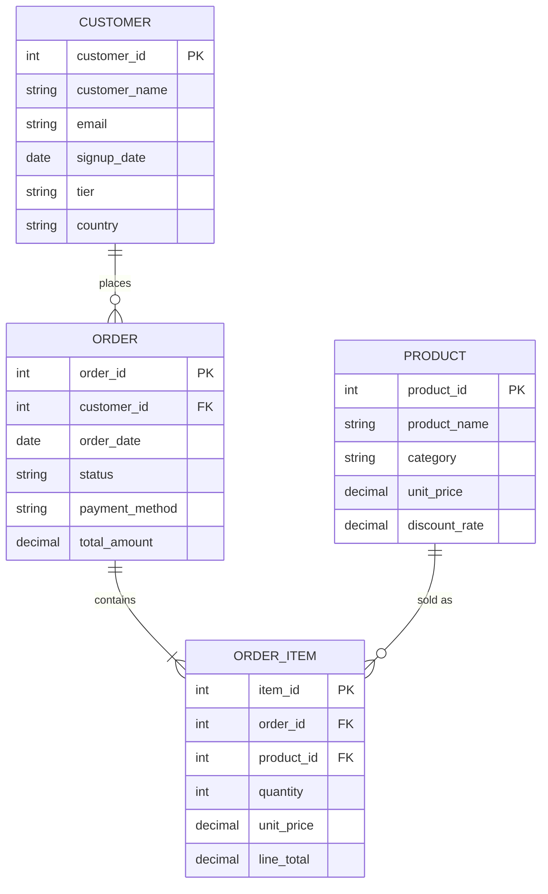

# E-commerce Model - ERD

Generated by MDDE

## Entity Relationship Diagram

## Entity Summary

| Entity | Stereotype | Layer | Description |
|--------|------------|-------|-------------|
| customer | dim_scd2 | business | Customer master data with tier classification |
| order | dim_fact | business | Order header with status and payment information |
| product | dim_dimension | business | Product catalog with categories and pricing |
| order_item | dim_fact | business | Individual line items within an order |

## Relationships

| From | To | Cardinality | Description |
|------|-----|-------------|-------------|
| customer | order | 1:N | Customer places orders |
| order | order_item | 1:N | Order contains items |
| product | order_item | 1:N | Product sold as order items |

## Domains

| Domain | Values |
|--------|--------|
| customer_tier | BRONZE, SILVER, GOLD, PLATINUM |
| order_status | PENDING, CONFIRMED, SHIPPED, DELIVERED, COMPLETED, CANCELLED |
| payment_method | CREDIT_CARD, PAYPAL, BANK_TRANSFER, CRYPTO |
| product_category | Electronics, Furniture, Accessories, Clothing, Books |
