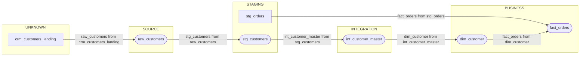

# Sales Layered Dataflow

```mermaid
%% Data Flow
%% Generated by MDDE Lite
flowchart LR
    subgraph SOURCE
        ent_raw_customers([raw_customers])
    end
    subgraph STAGING
        ent_stg_customers([stg_customers])
        ent_stg_orders[stg_orders]
    end
    subgraph INTEGRATION
        ent_int_customer_master([int_customer_master])
    end
    subgraph BUSINESS
        ent_dim_customer([dim_customer])
        ent_fact_orders([fact_orders])
    end
    subgraph UNKNOWN
        ent_crm_customers_landing[crm_customers_landing]
    end
    ent_int_customer_master -->|dim_customer from int_customer_master| ent_dim_customer
    ent_stg_orders -->|fact_orders from stg_orders| ent_fact_orders
    ent_dim_customer -->|fact_orders from dim_customer| ent_fact_orders
    ent_stg_customers -->|int_customer_master from stg_customers| ent_int_customer_master
    ent_crm_customers_landing -->|raw_customers from crm_customers_landing| ent_raw_customers
    ent_raw_customers -->|stg_customers from raw_customers| ent_stg_customers
```
