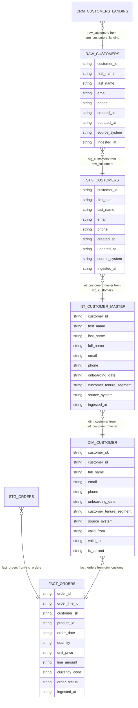

# Sales Layered ERD

```mermaid
%% Entity Relationship Diagram
%% Generated by MDDE Lite
erDiagram
    CRM_CUSTOMERS_LANDING {
    }
    DIM_CUSTOMER {
        string customer_sk
        string customer_id
        string full_name
        string email
        string phone
        string onboarding_date
        string customer_tenure_segment
        string source_system
        string valid_from
        string valid_to
        string is_current
    }
    FACT_ORDERS {
        string order_id
        string order_line_id
        string customer_sk
        string product_id
        string order_date
        string quantity
        string unit_price
        string line_amount
        string currency_code
        string order_status
        string ingested_at
    }
    INT_CUSTOMER_MASTER {
        string customer_id
        string first_name
        string last_name
        string full_name
        string email
        string phone
        string onboarding_date
        string customer_tenure_segment
        string source_system
        string ingested_at
    }
    RAW_CUSTOMERS {
        string customer_id
        string first_name
        string last_name
        string email
        string phone
        string created_at
        string updated_at
        string source_system
        string ingested_at
    }
    STG_CUSTOMERS {
        string customer_id
        string first_name
        string last_name
        string email
        string phone
        string created_at
        string updated_at
        string source_system
        string ingested_at
    }
    STG_ORDERS {
    }
    INT_CUSTOMER_MASTER }o--|| DIM_CUSTOMER : "dim_customer from int_customer_master"
    STG_ORDERS }o--|| FACT_ORDERS : "fact_orders from stg_orders"
    DIM_CUSTOMER }o--|| FACT_ORDERS : "fact_orders from dim_customer"
    STG_CUSTOMERS }o--|| INT_CUSTOMER_MASTER : "int_customer_master from stg_customers"
    CRM_CUSTOMERS_LANDING }o--|| RAW_CUSTOMERS : "raw_customers from crm_customers_landing"
    RAW_CUSTOMERS }o--|| STG_CUSTOMERS : "stg_customers from raw_customers"
```
