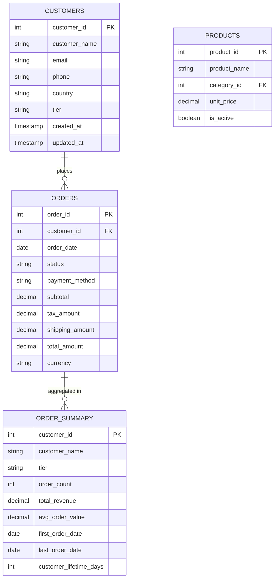

# Sales Model - Entity Relationship Diagram

Generated by MDDE Lite



## Data Flow

```
┌─────────────────┐     ┌─────────────────┐
│  raw_customers  │     │   raw_orders    │
│    (Source)     │     │    (Source)     │
└────────┬────────┘     └────────┬────────┘
         │                       │
         ▼                       ▼
┌─────────────────┐     ┌─────────────────┐
│    customers    │     │     orders      │
│   (Cleaned)     │     │   (Filtered)    │
└────────┬────────┘     └────────┬────────┘
         │                       │
         └───────────┬───────────┘
                     │
                     ▼
            ┌─────────────────┐
            │  order_summary  │
            │  (Aggregated)   │
            └─────────────────┘
```

## Lineage Summary

| Target Entity | Source Entities | Transformation |
|---------------|-----------------|----------------|
| customers | raw_customers | Filter active only |
| orders | raw_orders | Filter 2024+ |
| order_summary | customers, orders | Aggregate by customer |
